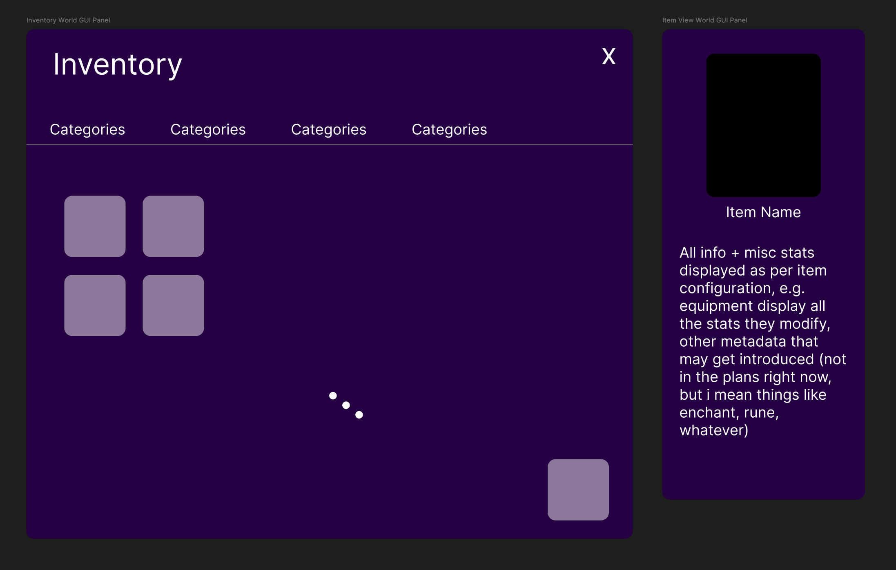
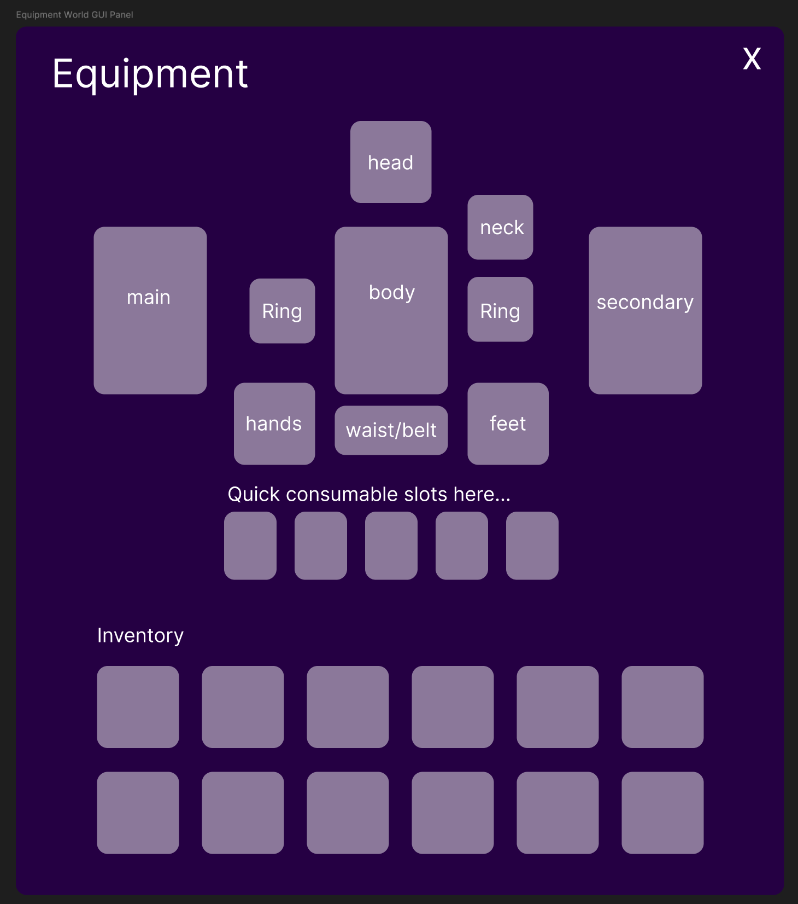

# Item + Inventory System Plan

## Goals
- Support unique item instances, stackable items, equipment slots, and consumables.
- Keep server authoritative for ownership and state, client mirrors for UI.
- Clean separation between static item definitions and per-item instance data.
- Make adding new item types straightforward (no special-case logic in inventory core).
- World-space UI: panels live in WorldGUIManager and must remain readable in 3D.

## Core Model (Recommended)
### 1) Static Item Definitions (Shared)
- ItemDef = immutable data by itemId (string key).
- Stored in a shared folder/module for client + server (e.g. src/shared/items/Defs/).
- Examples: name, rarity, category, stackLimit, icon, description, equipSlots, useAction, tags.

### 2) Item Instance (Server Auth)
- ItemInstance = runtime item state.
- Fields:
  - uid (unique ID; string GUID)
  - itemId (links to ItemDef)
  - stackSize (current size)
  - meta (optional per-instance data: roll stats, durability, etc.)
  - bound/locked (optional)

### 3) Inventory Containers
- Inventory (player-owned) with slots + stacking rules.
- Equipment (player-owned) with fixed slot layout.
- Optional: Storage, Bank, Loot containers.

### 4) Equipment Slots
- Fixed set: Weapon, Secondary, Armor, Helmet, Boots, Accessory1, etc.
- Rules based on ItemDef.equipSlots (allowed slots).

### 5) Item Categories
- Category is metadata only; behavior driven by item capabilities.
- Example capabilities: equip, consume, craft, quest.

---

## Data Shape (Draft)
### ItemDef (shared)
```
ItemDef = {
  id = "mana_potion",
  name = "Mana Potion",
  rarity = "common",
  category = "consumable",
  stackLimit = 20,
  icon = "rbxassetid://...",
  equipSlots = nil,
  useAction = "DrinkManaPotion",
  tags = { "consumable", "potion" },
}
```

### ItemInstance (server)
```
ItemInstance = {
  uid = "<guid>",
  itemId = "mana_potion",
  stackSize = 7,
  meta = {
    durability = 100,
    roll = { str = 2, dex = 1 },
  }
}
```

### Inventory (server)
```
Inventory = {
  ownerId = "<entityId>",
  capacity = 30,
  slots = {
    [1] = itemInstanceUid,
    [2] = nil,
    ...
  },
  stacks = {
    ["mana_potion"] = { uidA, uidB },
  }
}
```

### Equipment (server)
```
Equipment = {
  ownerId = "<entityId>",
  slots = {
    Weapon = itemInstanceUid,
    Armor = itemInstanceUid,
    Secondary = nil,
  }
}
```

---

## Server Responsibilities
- Own item instances and containers.
- Validate all moves (equip, unequip, split, merge, use, drop).
- Apply item effects (consume/use) and durability changes.
- Emit deltas to client (not full state every time).

## Client Responsibilities
- Mirror inventory + equipment for UI.
- Request actions (move, use, split, drop, equip).
- Resolve UI slots using ItemDef data.

---

## Sync Strategy (Suggested)
- Use delta updates: add/update/remove item instances and slot changes.
- Send full snapshot on initial load, then deltas.
- Keep ItemDefs static (shared); only send ids + instance data.

---

## Inventory Operations (Minimal Set)
- AddItem(itemId, count, meta?) -> create or stack.
- RemoveItem(uid or (itemId,count)).
- SplitStack(uid, splitCount).
- MergeStacks(uidA, uidB).
- MoveItem(uid, fromContainer, toContainer, toSlot?).
- Equip(uid, slot) / Unequip(slot).
- Use(uid) (consumables).

---

## UI Structure Notes (World-Space)
- Panels are WorldGUI panels managed by WorldGUIManager (not flat 2D ScreenGui).
- Camera shifts to over-the-right-shoulder when panels are open for readability.
- Readability priorities:
  - Larger font sizes than flat UI.
  - Higher contrast (avoid low-alpha text in world space).
  - Panel should face camera but remain anchored to player space.

### Panel Types
1) Inventory + Inspect View
   - Left: inventory grid with category tabs (scrollable grid).
   - Right: item detail panel driven by ItemInstance + ItemDef (rolls, durability, tags).
2) Equipment View
   - Center: equipment slot layout (PoE-style).
   - Under: quick consumable slots.
   - Bottom: inventory grid (scrollable if needed).

### Scrollable Inventory
- Inventory grid sits inside a ScrollFrame.
- Category strip stays outside scroll (sticky header).

---

## Backlog: World Panel Interaction System
- Allow dragging panels in a 2D plane that exists in world space.
- Prevent panels from overlapping in that 2D plane (simple AABB collision in UI-plane space).
- Panel priority + snap zones (e.g. inventory left, inspect right).
- Add a panel layout controller to WorldGUIManager.

---

## Suggested File/Module Layout
- src/shared/items/Defs/*.luau (static defs)
- src/shared/items/Registry.luau (loads defs by id)
- src/server/Inventory/InventoryService.luau
- src/server/Inventory/EquipmentService.luau
- src/server/Inventory/ItemInstances.luau (uid generation + storage)
- src/client/Inventory/InventoryClient.luau
- src/client/Inventory/EquipmentClient.luau
- src/client/ui/controllers/InventoryUIController.luau

---

## Decisions (Confirmed)
1) Containers: Separate Equipment and Inventory containers. Equipment can hold gear and combat consumables (rechargeable flask-style items). Inventory holds misc/materials/etc. Each has independent capacity and can be expanded.
2) Stacking rules: Equipment is non-stackable. For other items, meta-sensitive stacking is allowed (stacking depends on which meta fields are marked sensitive).
3) UID format: Use GUID strings for item instance IDs (consistent with entity IDs).
4) Drop/Loot: Items should have droppable world object representations; enemies/resources can drop loot.
5) Persistence: Add a stub DataManager (no-op methods) so systems integrate now; real DataStore later.
6) Rechargeable consumables: Items have charges and chargesConsumed per use. Refill is driven by an arbitrary condition (kills, time, on-hit, etc.).
7) Equipment model (PoE-like): Base equipment defines base stats/reqs/metadata. Rarity layers add prefixes/suffixes and rolls; uniques are their own definitions with rolled ranges.
8) Equipment storage: Equipped items do NOT consume inventory slots (separate containers).

---

## Additional Notes
- Skills will later have their own world-space UI for quick-slot selection and direct casting (separate from detailed system panels). Out of scope for the item system build.

## Notes To Discuss
- Equipment animation overrides:
  - Allow equipment to provide optional overrides for default movement anims (idle/walk/run/jump) and skill anims.
  - Proposed pattern: `AnimKey -> OverrideAnimKey` mapping in equipment config.
  - Requires a centralized animation execution path so overrides apply consistently across systems.
- Basic attack architecture options:
  1) Equipping weapons grants temporary basic-attack skills (harder to coordinate dual‑wield).
  2) One universal basic attack skill that inspects equipped weapons:
     - 2.1) Weapon type infers execution (hitbox/anim/behavior).
     - 2.2) Weapon types own built‑in skills; basic attack forwards to the current attacking weapon and alternates between main/secondary when dual‑wielding.
- Equipment should not store local stats; it only modifies player stats/attributes via affixes and base stats.

### Sketch: Animation Overrides + Basic Attack (Later)
Goal: keep a single, centralized path so equipment overrides and weapon behavior are consistent in every system.

1) Centralized Animation Resolver
- Single module that all systems call to get an animation key (movement + skills).
- Input: `{ baseKey, context, equippedItems }`.
- Output: final animation key (base or overridden).
- Override sources:
  - ItemDef override map: `overrides = { ["Idle"] = "Idle_ArmorHeavy", ["BasicAttack_Sword"] = "BasicAttack_Sword_Leather", ... }`
  - Optional `priority` per item or per override group (e.g., armor overrides movement, weapons override attack).
- Resolution order:
  1) Collect overrides from equipped items.
  2) Apply highest priority override for the baseKey.
  3) Fallback to baseKey if no override.

2) Universal Basic Attack Skill
- One skill handles basic attacks for all weapon types.
- It inspects equipped items and picks an `AttackProfile` to execute.
- Dual‑wield: alternate between Main/Secondary if both have profiles; otherwise use Main.
- Barehand/gauntlet is just another profile.

3) AttackProfile (per weapon type)
- Declared in shared defs (or weapon‑type registry), not in inventory.
- Fields:
  - `animKey` (base), `hitboxTemplate`, `timing` (windup/release/recovery), `range`, `fxKey`, `soundKey`.
  - Optional `combo` data if needed.
- Profile selection driven by equipped weapon type (sword/greatsword/staff/gauntlet).

4) Stats
- Equipment does NOT store local stats.
- Profiles are behavior/visual only; damage numbers come from player stats + skill formulas.

5) Integration Points (when ready)
- Resolver called from:
  - Movement controller (idle/walk/run/jump).
  - Skill framework (BasicAttack only, later possibly other skills).
- BasicAttack skill uses resolver to get correct anim key and hitbox behavior.

## Visuals & Attachment Strategy
- Prefer item models that include a `Handle` BasePart (or set a PrimaryPart) so the server can weld consistently.
- Use Attachments for alignment:
  - Character side: pick a target attachment or part name (e.g. `RightHand`, `LeftHand`, `UpperTorso`, `HumanoidRootPart`).
  - Item side: optional `itemAttach` (Attachment name inside the item model) to align cleanly without hand-tuned offsets.
- Slot-specific visuals live in `ItemDef.visuals[slot]` so the same item can attach to right/left hand depending on equipped slot.
- Offsets remain optional for small tuning, but prefer attachments for repeatable placement.

---

## Next Step
- Confirm data shapes and operations.
- I will wire the minimal registry + services and set up client mirroring with deltas.

## Progress (Implemented)
- Shared item registry + defs (ManaPotion, IronSword, LeatherChest) and item types.
- Server inventory/equipment services with delta replication.
- Client inventory mirror (snapshot + deltas).
- Equipment visuals attach per slot with `itemAttach` support.
- InventoryPanel + ItemInspectPanel controller:
  - Inventory grid + category filters.
  - Item inspect with stats + meta lines.
  - Action bar with Equip/Unequip/Use (disabled via meta flags).
  - Inventory handle toggles expanded/collapsed panel.




